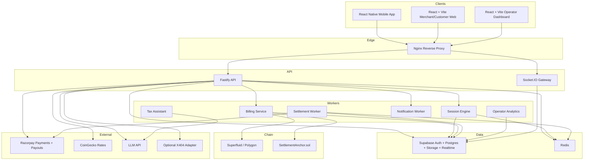

# Detrix Platform

Production-oriented monorepo for a location-aware pay-per-use platform with:

- Fiat entry via Razorpay or UPI
- Internal crypto-native wallet accounting
- Geofence and QR-triggered sessions
- T+1 merchant settlement in INR
- Merchant analytics and tax assistant
- Operator revenue dashboard

## Architecture



## Monorepo Layout

```text
apps/
  mobile/
  dashboard/
  operator/
services/
  api/
  session-engine/
  billing/
  blockchain-adapter/
  settlement/
  tax-assistant/
  notification/
  operator-analytics/
packages/
  shared-types/
  supabase-client/
  zod-schemas/
  billing-core/
  x404-adapter/
  geofence-utils/
  qr-utils/
contracts/
infra/
supabase/
```

## Local Setup

1. Copy `.env.example` to `.env`.
2. Install dependencies with `pnpm install`.
3. Start local infrastructure with `docker compose up -d`.
4. Apply Supabase SQL from `supabase/migrations/0001_init.sql`.
5. Run `pnpm dev`.

## Frontend And Backend Connection

- `apps/dashboard` uses Supabase Auth for login and role detection.
- After login, the dashboard calls `services/api` with the Supabase access token as a Bearer token.
- `services/api` validates the token with Supabase Auth and resolves the caller role from `profiles`.
- Live updates use Socket.IO with the same access token in the socket auth payload.
- User sessions emit to `user:<id>` rooms, merchant events emit to `merchant:<id>`, and operator events emit to the `operator` room.

## Session And Settlement Flow

1. User tops up wallet in INR through Razorpay order creation.
2. Wallet credit is recorded in `wallets` and `wallet_transactions`.
3. Session starts through geofence or QR.
4. `SessionService` locks the rate, writes `session_events`, and emits live dashboard events.
5. Session close calculates gross INR, operator fee, merchant payout, wallet debit, and `operator_ledger`.
6. T+1 settlement groups prior-day closed sessions into `settlement_batches` and marks them completed after payout orchestration.

## Smart Contract Connection

- `contracts/src/DetrixMerchantRegistry.sol` stores merchant payout registration metadata for the on-chain control plane.
- `contracts/src/DetrixSessionManager.sol` anchors start, close, and dispute references for sessions.
- `contracts/src/SettlementAnchor.sol` stores final settlement hashes and operator fee references.
- `services/blockchain-adapter` signs and sends transactions to those contracts.
- `services/api/src/services/session-service.ts` can call the blockchain adapter when `SESSION_BILLING_PROVIDER=superfluid` and the contract addresses are configured.

## Environment Variables

Minimal local `pnpm dev` setup:

- `SUPABASE_URL`
- `SUPABASE_ANON_KEY`
- `SUPABASE_SERVICE_ROLE_KEY`
- `VITE_SUPABASE_URL`
- `VITE_SUPABASE_ANON_KEY`
- `VITE_API_URL`
- `EXPO_PUBLIC_SUPABASE_URL`
- `EXPO_PUBLIC_SUPABASE_ANON_KEY`
- `EXPO_PUBLIC_API_URL`

Useful local overrides:

- `API_BASE_URL`
- `DASHBOARD_URL`
- `REDIS_URL`
- `PLATFORM_FEE_RATE`

Optional feature-specific integrations:

- `RAZORPAY_KEY_ID`
- `RAZORPAY_KEY_SECRET`
- `RAZORPAY_WEBHOOK_SECRET`
- `RAZORPAY_ACCOUNT_NUMBER`
- `COINGECKO_API_KEY`
- `LLM_API_URL`
- `LLM_API_KEY`
- `RESEND_API_KEY`
- `EXPO_ACCESS_TOKEN`
- `SENTRY_DSN`
- `SESSION_BILLING_PROVIDER`
- `POLYGON_RPC_URL`
- `SUPERFLUID_PRIVATE_KEY`
- `MERCHANT_REGISTRY_ADDRESS`
- `SESSION_MANAGER_ADDRESS`
- `SETTLEMENT_ANCHOR_ADDRESS`
- `CHAIN_FALLBACK_PAYOUT_ADDRESS`

## Contract Deployment

1. Install dependencies with `pnpm install`.
2. Set blockchain env vars in `.env`.
3. Run `pnpm --filter @detrix/contracts build`.
4. Run `pnpm --filter @detrix/contracts deploy:local` or adapt the Hardhat command for the target testnet.
5. Copy deployed addresses into `.env`.

## Validation Steps

1. Start Supabase, Redis, API, and dashboard.
2. Register two users and promote one to `merchant` in `profiles`.
3. Merchant creates venue, pricing plan, geofence, and QR.
4. Customer tops up wallet.
5. Customer starts session via QR or geofence.
6. Confirm merchant dashboard updates immediately through Socket.IO.
7. Close session and verify:
   - wallet debit
   - session close event
   - operator ledger entry
   - merchant net payout amount
8. Run `POST /admin/settlements/run` for the prior day and confirm `settlement_batches`.
